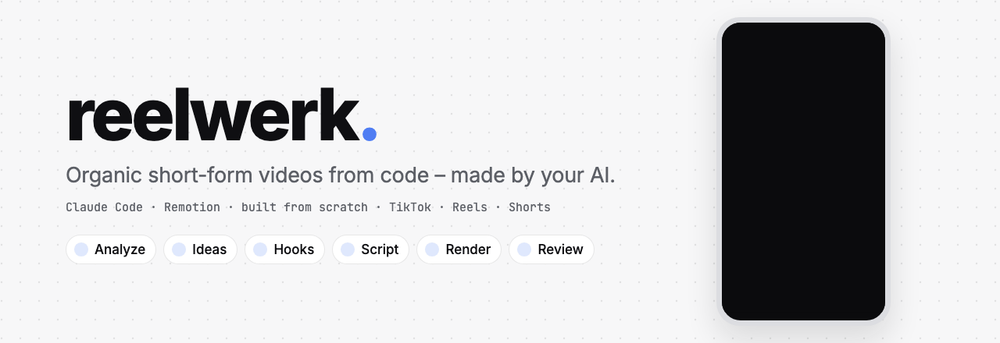

<picture>
  <source media="(prefers-color-scheme: dark)" srcset=".github/assets/banner-dark.gif">
  
</picture>

<div align="center">

**Give this repo to your AI. It reads your project, then makes organic short-form videos for it – rendered from code.**<br/>
Some inform, some entertain, some show the product. Your project decides the mix. You pick, you post.

[](LICENSE)
[](CREDITS.md)
[](https://claude.com/claude-code)
[](blueprint/04-script.md)

[Quickstart](#quickstart) · [How it works](#how-it-works) · [What's inside](#whats-inside) · [Principles](#principles) · [Credits](CREDITS.md) · [Deutsch](LIESMICH.md)

</div>

Most "AI content machines" produce the same average videos everyone else produces. reelwerk starts somewhere else: **your project.** Before a single idea is written, your AI reads your codebase, docs and site to understand what the product really does, and decides which kinds of video make sense for *this* product – a study app might teach, a game might mostly entertain, a dev tool might mostly demo. Then it works through a step-by-step blueprint: ideas forced to be different, a batch of hooks per idea, a script, a render, automatic checks. You pick the ideas and approve every video.

The workflow uses skills from people who do this for a living. The videos themselves are not assembled from templates: **every video is written from scratch for its idea** – its own visual metaphor, motion and transitions – with only your brand (colours, fonts, character) as given.

---

## Quickstart

You need [Node.js](https://nodejs.org) 20+, [ffmpeg](https://ffmpeg.org), and an AI coding agent – built for [Claude Code](https://claude.com/claude-code).

```bash
git clone https://github.com/nikolajhh2008-svg/reelwerk.git
cd reelwerk
./setup.sh
claude
```

Check that rendering works:

```bash
mkdir -p work/videos/hello && cp examples/hello/Video.tsx work/videos/hello/
node studio/render.mjs work/videos/hello
```

Then say:

> Analyse my project: ~/code/my-app

The AI reads it, drafts your `brand/` files and asks a handful of questions. After that, one sentence is enough:

> make videos

You get a shortlist of ten ideas with three hooks each, pick the ones you like (`2b, 5a, 7c`), and the finished videos land in `work/videos/` with a contact sheet and a check report. **Nothing is ever posted automatically.**

---

## How it works

| # | Step | What happens |
|---|---|---|
| 0 | [Analyze](blueprint/00-analyze.md) | read the project to understand it – what it really does, for whom; find two-second moments; **derive the mix of informing, entertaining and showing videos**. Nothing visual is taken from the project |
| 1 | [Strategy](blueprint/01-strategy.md) | one viewer, one goal, a bullseye of topics, a weekly mix – confirmed by you |
| 2 | [Ideas](blueprint/02-ideas.md) | ~100 raw ideas from real signals – trends from anywhere in culture, transferred onto your topic – forced to differ, filtered, ranked in pairs |
| 3 | [Hooks](blueprint/03-hooks.md) | a batch of hook packages per idea, audited for the four hook killers – **you pick** |
| 4 | [Build](blueprint/04-script.md) | a premise, two directions, four key frames – then the video coded from scratch in Remotion, cut to a music bed generated for it, with sound effects synthesised in code |
| 5 | [Render](blueprint/05-render.md) | render, measure sound and dead time, contact sheet, keep every version |
| 6 | [Review](blueprint/06-review.md) | code measures levels, sync and dead time, a pixel-only critic runs at least three rounds, **you watch and listen** |
| 7 | [Publish](blueprint/07-publish.md) | by hand, the platform rules that matter |
| 8 | [Learn](blueprint/08-learn.md) | real numbers re-weight what comes next |

---

## What's inside

```
blueprint/        the workflow, step by step – what the AI follows
brand/            your project, filled in by the AI in step 0 (empty here)
.claude/skills/   31 third-party skills: ideas, trend transfer, hooks, visual ideas, motion, sound, critique
.claude/agents/   direction lister, blind selector, pixel-only critic (from remotion-director)
docs/craft.md     20 measured rules: rhythm, character animation, sound, transitions
studio/           Remotion project: finds every work/videos/<id>/Video.tsx, brand helpers,
                  render.mjs (render → measure sound → contact sheet → dead-time check),
                  music.mjs (music bed via Google Lyria), beats.py (measured beat grid)
examples/         a small from-scratch video to copy
sfx/              177 CC0 sound effect files (optional – effects are synthesised in code)
setup.sh          installs the studio, the official Remotion skills and the Python audio tools
```

The banner above was rendered with `studio/` itself.

---

## Principles

1. **The project decides, not the kit.** Content mix, topics and formats come from analysing your project.
2. **Data finds the topic, taste makes the angle.** Without real input every model produces the same average ideas – answers from different model families are 71–82 % similar ([Jiang et al., NeurIPS 2025](https://arxiv.org/abs/2510.22954)).
3. **The generator is not the judge – and the human has the last word.** An LLM judge let AI captions win 54 % against the best human ones; a former New Yorker cartoon editor chose them 1.6 % of the time ([Zhang et al. 2024](https://arxiv.org/abs/2406.10522)).
4. **Built from scratch, every time.** No template library: each video gets its own visual idea, motion and transitions, checked against measured craft rules.
5. **Real visuals only, never a text-only slideshow.** TikTok rates slideshow-only videos as low quality, Instagram shows mostly-text reels less (sources in [07-publish.md](blueprint/07-publish.md)).
6. **Nothing posts itself.** You watch every video and post it by hand.

---

## Licence

MIT for the parts written for reelwerk. Third-party skills, components and sounds keep their own licences – see [CREDITS.md](CREDITS.md). Remotion is under the [Remotion License](https://www.remotion.dev/license) (free for individuals and companies of up to 3 people).
